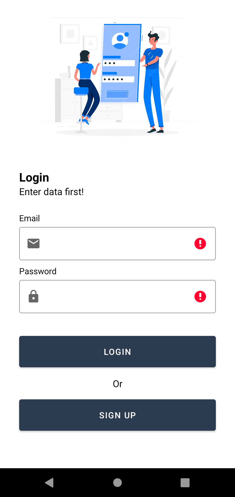
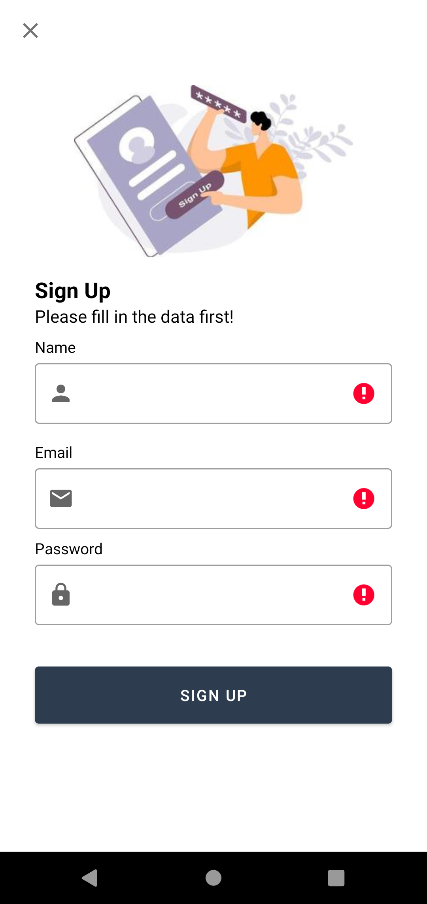
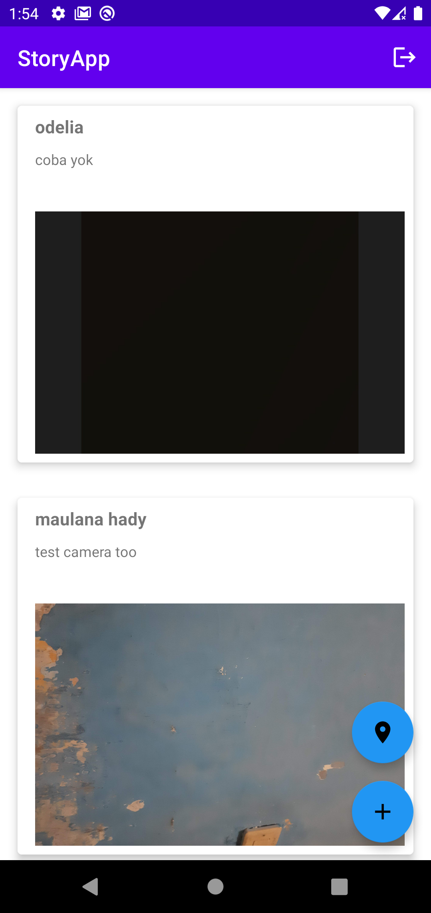
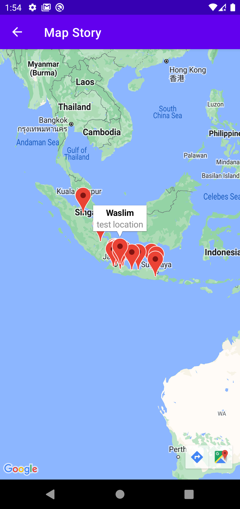
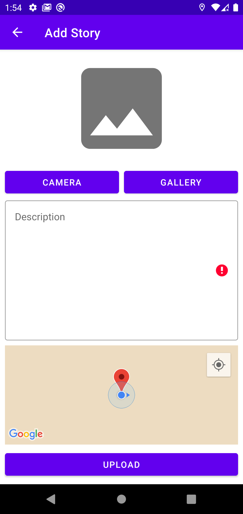

# StoryApps
StoryApps adalah aplikasi untuk berbagi cerita seperti sharing pengalaman dan sebagainya. Aplikasi ini saya buat di waktu saya mengikuti event <a href="https://digitalent.kominfo.go.id/detail/pelatihan/3323?akademiId=152">Digital Talent ScholArsip (DTS) Android Dev Intermediete</a>
dan mengikuti course dari dicoding yaitu <a href="https://www.dicoding.com/academies/352">Belajar Pengembangan Aplikasi Android Intermediate</a> 

# Screenshot

# Fitur-fitur yang di sediakan
- [X] Login
- [X] Register
- [X] List cerita
- [X] Upload cerita user menggunakan foto & lokasi
- [X] Menampilkan semua titik lokasi user

# Yang di pelajari 
- Android Advanced UI
- Android Animation
- Android Localization & Accessibility
- Android Service & Android Media
- Tips dan Trik Submission
- Android Geo Location
- Android Advanced Testing
- Android Advanced Database
- Android Paging
- Firebase

# Tools & Languange:
- Kotlin
- Android Studio
